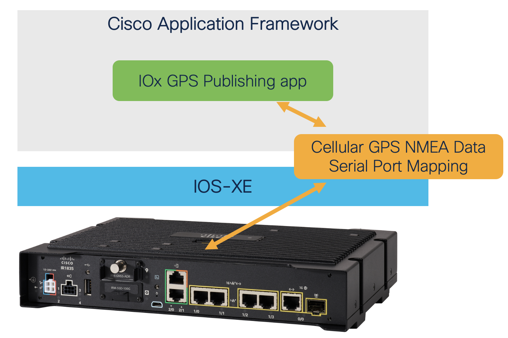
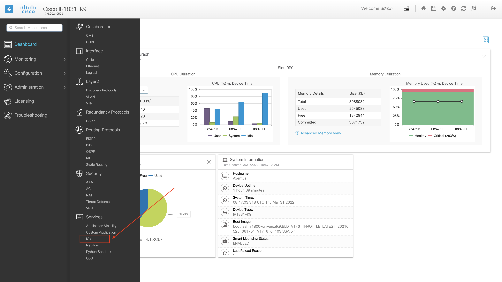
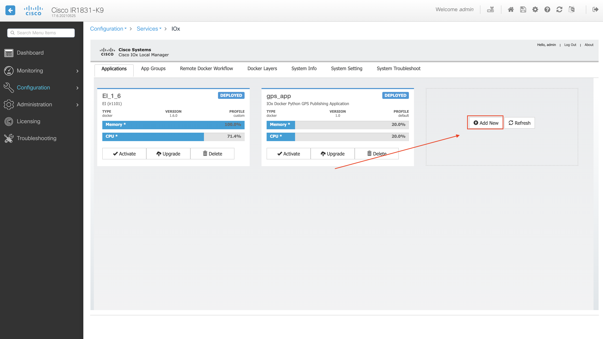
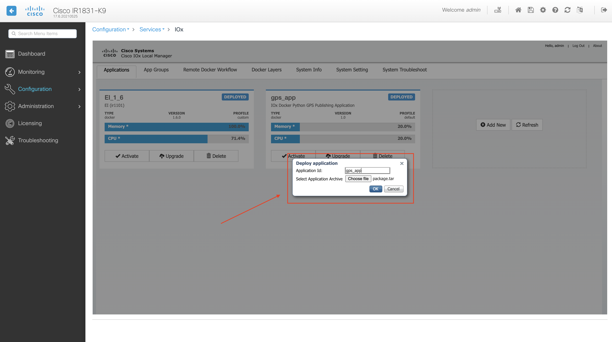
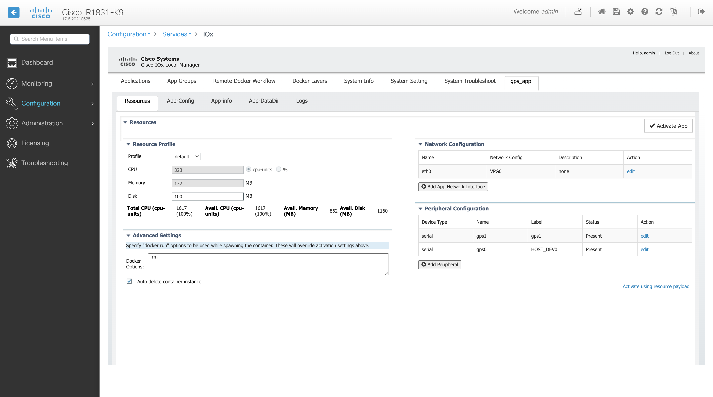
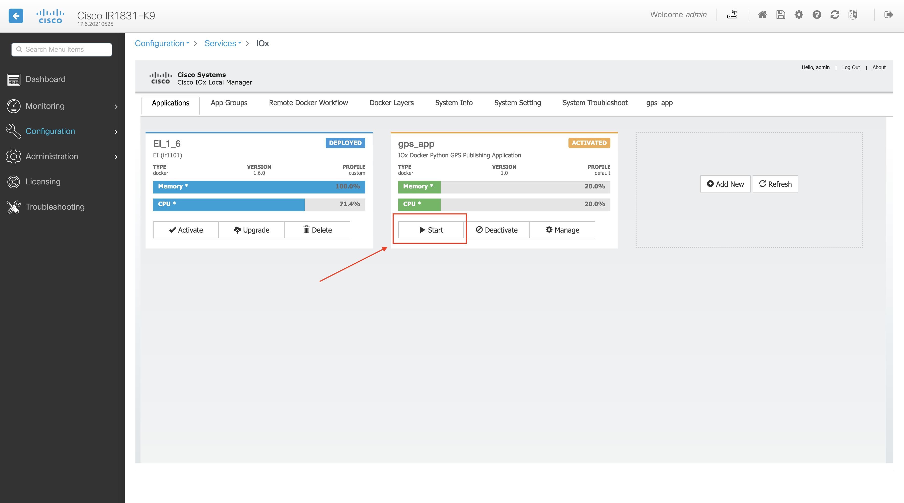
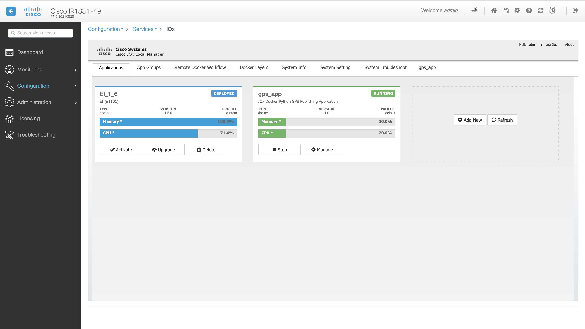
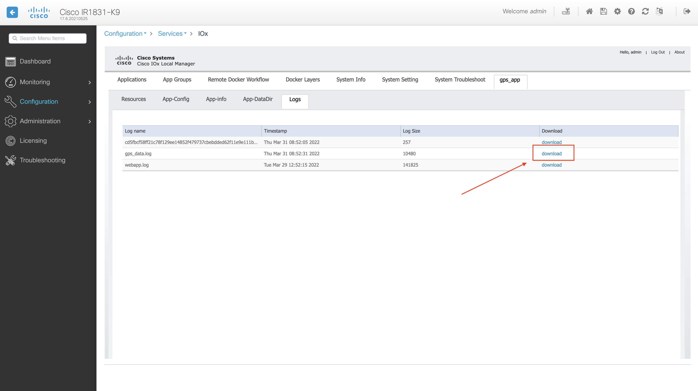
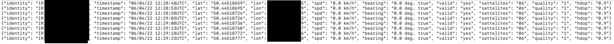

# GVE DevNet IOx GPS Publishing App - IR1800

This prototype hold an IOx app for publishing GPS data as read from an Cisco Catalyst IR1800 to either application log files, or a user-defined REST endpoint.

## Overview



## Pre-requisites

1. A running Docker daemon, as can be installed [here](https://www.docker.com/products/docker-desktop/)

2. The `ioxclient` CLI tool, as can be downloaded [here](https://developer.cisco.com/docs/iox/#!iox-resource-downloads/downloads)

3. A IR1800 device, enabled for GPS following the configuration listed [here](https://www.cisco.com/c/en/us/td/docs/routers/access/IR1800/software/b-cisco-ir1800-scg/m-configuring-gps.html)

## Installation

1. Clone this repository

```
$ git clone https://github.com/gve-sw/gve_devnet_iox_gps_publishing.git
$ cd gve_devnet_iox_gps_app_ir1800
```

2. In `main.py`, set your REST endpoint on line 54. 

3. Build the Docker container

```
$ docker build -t ioxdockergps .
```

4. Package the application for IOx deployment (NOTE: This step creates a `package.tar` file that will be used later on in this guide)

```
$ ioxclient docker package ioxdockergps .
```

5. Deploy the IOx app

- In your IR1800 Web UI, Navigate to `Configuration > Services > IOx`



- You will be prompted to log in to your IOx Local Manager

- Create a new app



- Upload the `package.tar` file as generated in step 3



- Activate your new app


- Set the activation payload for your app as follows (! Mind the `Peripheral Configuration` tab, connecting to your device's serial device that is streaming GPS data)



- Start your application



- Verify that the application is running



- In the log files for your application, download the `gps_app_data.log` file to consult your app's output.



- Verify the application's output to hold GPS data



### LICENSE

Provided under Cisco Sample Code License, for details see [LICENSE](LICENSE.md)

### CODE_OF_CONDUCT

Our code of conduct is available [here](CODE_OF_CONDUCT.md)

### CONTRIBUTING

See our contributing guidelines [here](CONTRIBUTING.md)

#### DISCLAIMER:
<b>Please note:</b> This script is meant for demo purposes only. All tools/ scripts in this repo are released for use "AS IS" without any warranties of any kind, including, but not limited to their installation, use, or performance. Any use of these scripts and tools is at your own risk. There is no guarantee that they have been through thorough testing in a comparable environment and we are not responsible for any damage or data loss incurred with their use.

You are responsible for reviewing and testing any scripts you run thoroughly before use in any non-testing environment.

